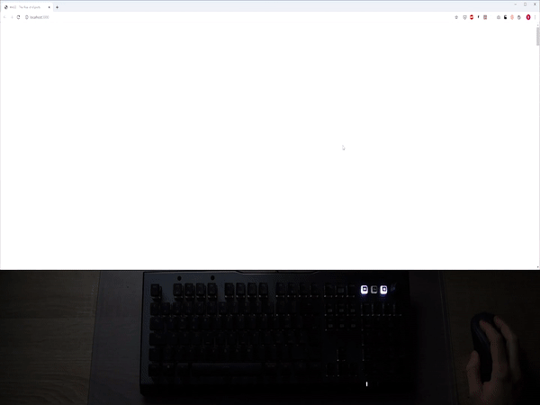

# [WASD] - The Rise of eSports - DataViz based on a Keyboard
This is an experimental story using a [Roccat Vulcan 120 Keyboard](https://de.roccat.org/Keyboards/Vulcan-120-AIMO) and a Screen for data visualisations.  
See the Result in the video below. In the Story there are:
* data visualisations (Bar Charts, etc)
* a typing test
* a game running fully on the keyboard

For more information, have a look at my website: www.journalist.sh
## Demo / Video

## Requirement
* a [Roccat Vulcan Keyboard](https://de.roccat.org/Keyboards/)
* NodeJS

## Installation
* clone this Repository
* open folder `client` in terminal and run `npm install`
* open folder `server` in terminal and run `npm install`
* Update your Keyboard ID. See [API-Documentation](https://github.com/simonhuwiler/roccatvulcan)

## Run Story:
* Start Server: `npm start` in folder `server`
* Start Client: `npm start` in folder `client`

## Keyboard API
The server talks to the keyboard per HID, therefore it should run on Mac and Linux. But it is tested only on windows.  
The API to connect to your Roccat Vulcan is open source.  

Have a look at:
* GitRepo: https://github.com/simonhuwiler/roccatvulcan
* npm: https://www.npmjs.com/package/roccatvulcan

## Slides of the story
### Intro

### Pong

### Bar charts

### Spreading keys

### Writing test

### Keyboard Game
